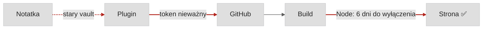

---
{"dg-publish":true,"dg-path":"Notatki/Automatyzacja psuje się po cichu.md","permalink":"/notatki/automatyzacja-psuje-sie-po-cichu/","noteIcon":"","created":"2026-09-25","updated":"2026-09-25","dg-note-properties":{"status":"kiełek","created":"2026-09-25","updated":"2026-09-25","zrodla":["[[Development/PanRada/_index]]"],"medium":null}}
---

Strona działała. Domena opłacona, certyfikat ważny, wszystko się ładowało. Tylko że od prawie dwóch lat nic się na niej nie pojawiło — i długo nie wiedziałem dlaczego.

## Co się stało

Ten ogród to prosta automatyzacja: piszę notatkę w Obsidianie, plugin wysyła ją na GitHuba, a hosting buduje z niej stronę. Kiedy po przerwie chciałem do niego wrócić, okazało się, że po drodze zepsuły się trzy rzeczy:

*Czerwone połączenia zepsuły się bez żadnego komunikatu. Strona na końcu przez cały czas wyglądała dobrze.*

- **Automatyzacja została w starym vaulcie.** Przeniosłem notatki do nowego, a publikacja nadal była podpięta pod stary.
- **Token do GitHuba przestał działać.** Błąd było widać tylko w ustawieniach pluginu, do których nikt nie zagląda.
- **Hosting za 6 dni wyłączał wersję Node, na której stał projekt.** Strona dalej by działała, ale każda próba publikacji kończyłaby się czerwonym buildem.

Żadna z tych rzeczy nie była trudna do naprawienia. Trudne było to, że żadna nie dała znać, że się zepsuła.

## Najgroźniejsza awaria to ta bez komunikatu

Automatyzacje psują się inaczej niż aplikacje. Aplikacja, która nie działa, ma użytkowników, którzy od razu to zgłaszają. Automatyzacja, która nie działa, po prostu przestaje robić swoje, a jej widoczna część wygląda tak samo jak wczoraj. Dowiadujesz się dopiero wtedy, gdy chcesz jej użyć. Czasem po tygodniu, czasem po dwóch latach.

Zanim uznasz automatyzację za skończoną, zadaj jej trzy pytania:

1. **Kiedy wygasa?** Tokeny, certyfikaty, wersje runtime'u na hostingu — wszystko ma datę ważności, nawet jeśli nikt jej nie zapisał.
2. **Kto jej używa i jak często?** Automatyzacja bez rytmu użycia to automatyzacja bez monitoringu.
3. **Skąd się dowiem, że przestała działać?** Jeśli odpowiedź brzmi „zobaczę przy okazji”, to znaczy, że nie ma odpowiedzi.

## Karta tego ogrodu

Sam trzymam się tych pytań. Tak wygląda karta tego ogrodu po naprawie:

| Pytanie | Ten ogród |
|---|---|
| **Kiedy wygasa?** | Token nie wygasa, ale ma dostęp tylko do jednego repozytorium i dwa uprawnienia. Wersja Node jest zapisana w projekcie, więc zmienia się razem z kodem. |
| **Kto jej używa i jak często?** | Ja, co tydzień w niedzielę. Przypomnienie przychodzi samo. |
| **Skąd się dowiem, że przestała działać?** | Każda publikacja kończy się sprawdzeniem strony. Opis całego pipeline'u i znanych pułapek mam w jednej notatce, więc naprawa to minuty, a nie całe popołudnie. |

Ta notatka jest pierwszą po przerwie. Doszła na stronę, bo tym razem wiem, co może ją po cichu zatrzymać.
